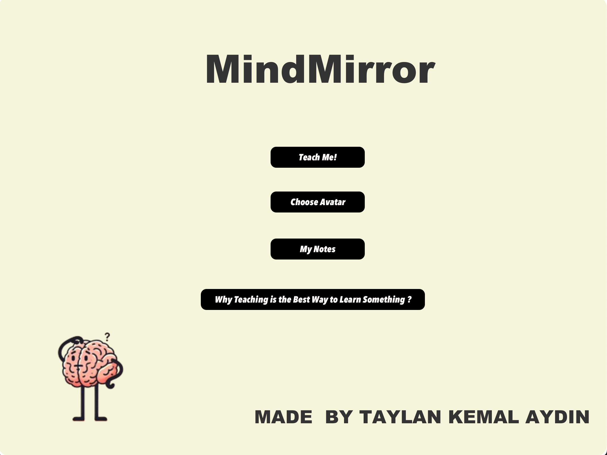

# Mind Mirror

**🧠 A learning companion application designed to enhance knowledge retention through interactive teaching methods. Built using JavaFX and Azure Speech API.**

---

## 🚀 Features

- **Interactive Learning:** Teach concepts to an AI avatar to strengthen your understanding.
- **Speech Recognition:** Converts your spoken words into written text (requires Azure Speech API key).
- **Visual Aids:** Provides graphical breakdowns and visualizations to better understand concepts.
- **Note Management:** Save and edit your notes within the application.
- **Progress Tracking:** Tracks and displays learning milestones and progress percentages.

---

## 📊 Key Benefits

- **Enhanced Retention:** Studies suggest that teaching increases learning retention by up to **40%**.
- **Custom Learning Paths:** Helps users solidify their knowledge while simultaneously generating organized written notes.
- **Ease of Use:** User-friendly interface with multiple avatars for personalization.

---

## 🛠️ Technologies Used

- **JavaFX:** For building an interactive graphical user interface.
- **Azure Speech API:** Converts speech to text (requires personal API key).
- **Custom Animations and Visuals:** Unique graphics and animations for an immersive learning experience.

---

## 📖 How to Set Up

To use the application:

1. Clone this repository:
   ```bash
   git clone https://github.com/taylnAydin/Mind-Mirror.git
   cd Mind-Mirror
   2. Ensure you have the following installed:
   - **Java 11 or later:** Required to run the application.
   - **Maven:** For managing dependencies and building the project.

2. Ensure you have the following installed:
   - **Java 11 or later:** Required to run the application.
   - **Maven:** For managing dependencies and building the project.

3. Install project dependencies and build the project:
   ```bash
   mvn clean install

4. Configure the Azure Speech API:
   - Navigate to the `resources` folder.
   - Open the `config.properties` file.
   - Replace `YOUR_API_KEY_HERE` with your Azure Speech API key.

5. Run the application:
   ```bash
   mvn javafx:run
6. **Customize Avatars:**
   - Replace or update the avatars in the `src/main/resources/com/aydin/mindmirror/avatars` folder with your own PNG files if desired.
   - Ensure the file format and dimensions match the original images.

7. **Review Learning Progress:**
   - The application automatically tracks and visualizes learning progress.
   - Access the "Progress" tab within the application to view detailed analytics and insights.

8. **Export Notes:**
   - All notes created during your learning sessions can be saved locally.
   - Use the "Export" button in the "My Notes" section to download your notes in text format for offline use.

## 🎨 Visual Previews

### Main Menu


### Avatar Selection


## 💡 Future Improvements

- **Cloud Storage Integration:** Save and sync notes across devices.
- **Real-Time Feedback:** AI-generated feedback based on learning interactions.
- **Multilingual Support:** Expand the application’s functionality to support additional languages.


## 🤝 Credits

- **Developed by Taylan Kemal Aydın.**
- Special thanks to **JavaFX** and **Azure Speech API** for powering this innovative learning application.
